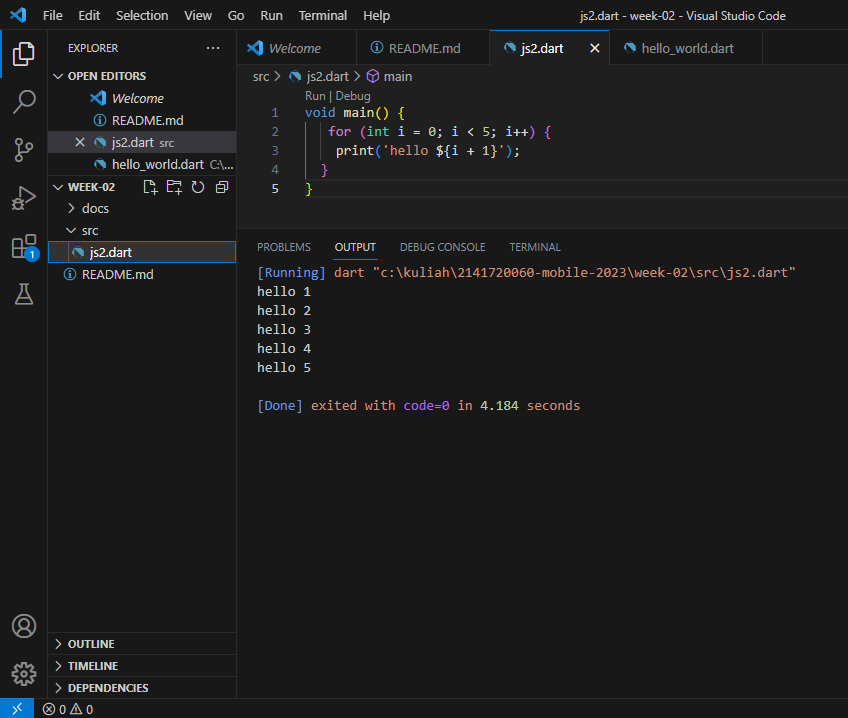
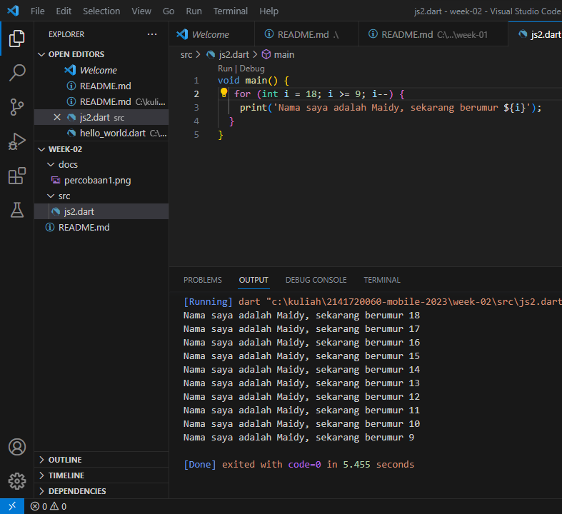

# PRAKTIKUM MOBILE WEEK 02

Hasil Screenshoot:

Percobaan 1:

SOAL 1

SOAL 2

Mengapa sangat penting untuk memahami bahasa pemrograman Dart sebelum kita menggunakan framework Flutter ? Jelaskan!

Jawaban: Memahami bahasa pemrograman Dart sebelum menggunakan framework Flutter sangat penting karena Dart adalah bahasa pemrograman yang digunakan untuk mengembangkan aplikasi Flutter.

SOAL 3

Rangkumlah materi dari codelab ini menjadi poin-poin penting yang dapat Anda gunakan untuk membantu proses pengembangan aplikasi mobile menggunakan framework Flutter.

Jawaban: Dart adalah bahasa pemrograman yang dirancang untuk menggabungkan kelebihan bahasa tingkat tinggi dengan fitur-fitur terkini. Fitur utamanya termasuk produktivitas, garbage collection, type annotations opsional, tipe statis, dan portabilitas. Dalam pengembangan Flutter, Dart adalah bahasa utama yang digunakan untuk semua komponen aplikasi. Pemahaman yang baik tentang Dart sangat penting untuk menjadi pengembang Flutter yang efisien dan kompeten.

Dalam Dart, terdapat operator aritmatika termasuk + (tambahan), - (pengurangan), * (perkalian), / (pembagian), ~/ (pembagian bilangan bulat), % (sisa bagi), dan -expression (negasi). Beberapa operator dapat berperilaku berbeda tergantung pada tipe operan.

Ada juga operator increment dan decrement, seperti ++var atau var++ untuk menambah atau mengurangi nilai variabel sebesar 1.

selain itu Dart memiliki operator persamaan == dan != untuk memeriksa kesamaan atau perbedaan antara operan, serta operator relasional seperti >, <, >=, dan <= untuk memeriksa hubungan relasional.

Operator logika seperti ! (negasi), || (OR), dan && (AND) digunakan untuk menggabungkan ekspresi boolean. Dart memiliki fitur keamanan tipe, sehingga operator == hanya membandingkan isi variabel, bukan alamat memori.

SOAL 4

Buatlah slide yang berisi penjelasan dan contoh eksekusi kode tentang perbedaan Null Safety dan Late variabel ! (Khusus soal ini kelompok berupa link google slide)

Kelompok 8:

- Magfiroh Indah Karisma (17)

- Maidy Putri Joshi (18)
