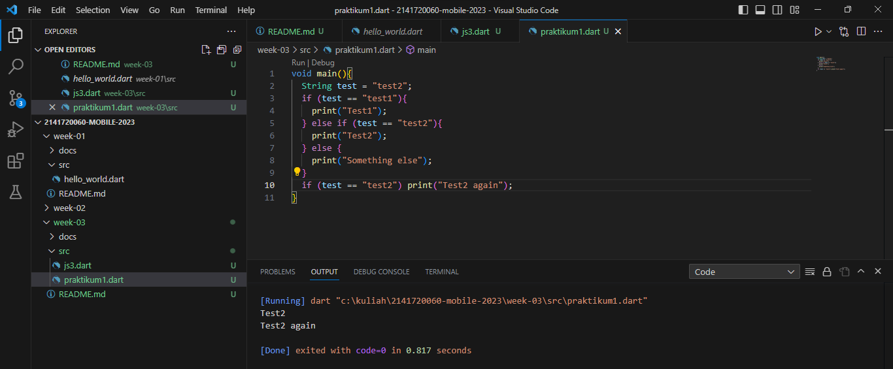
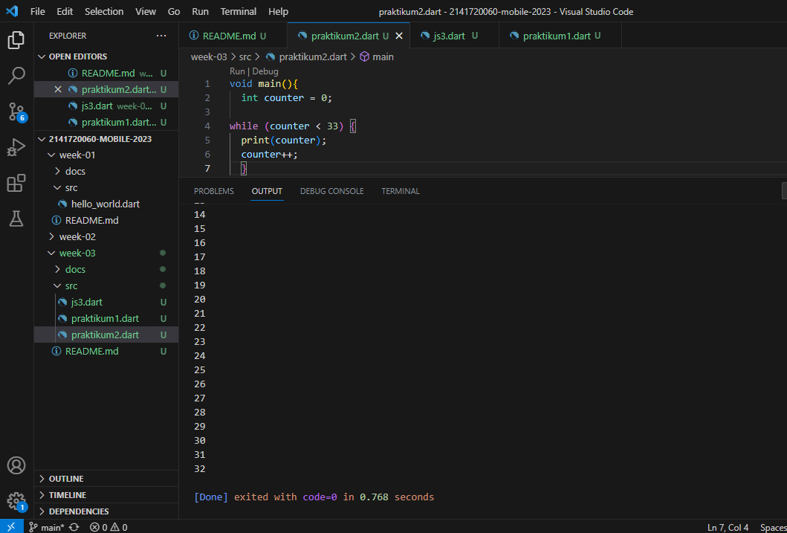
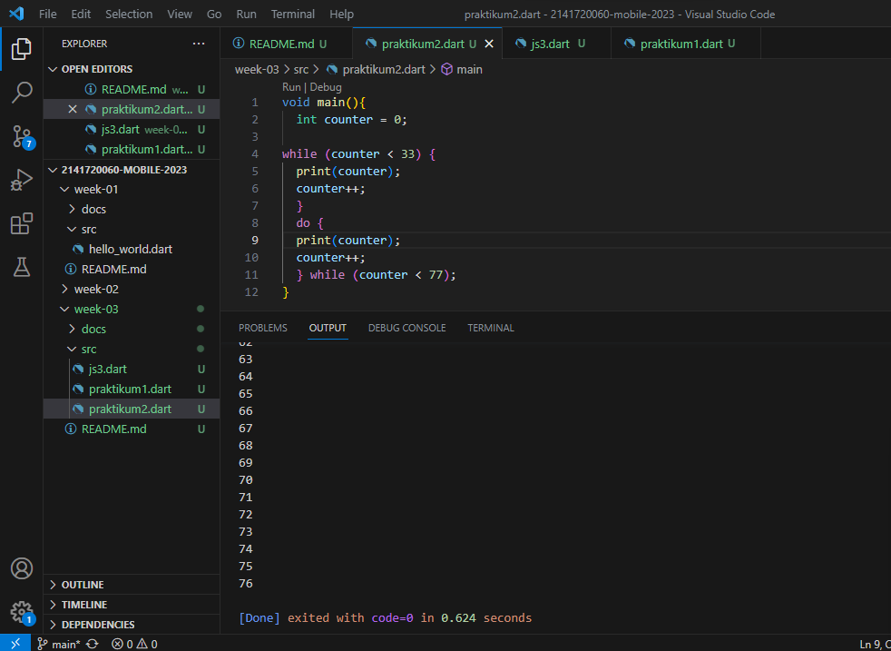
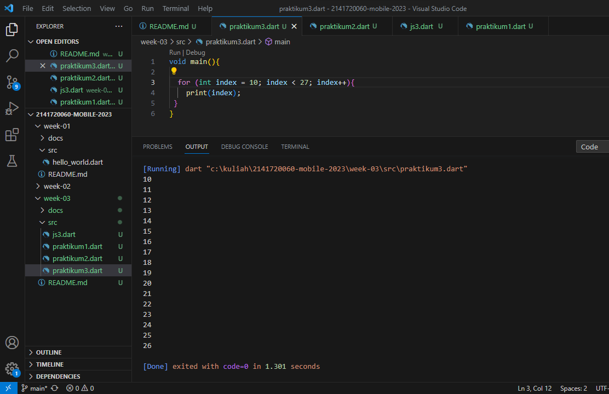
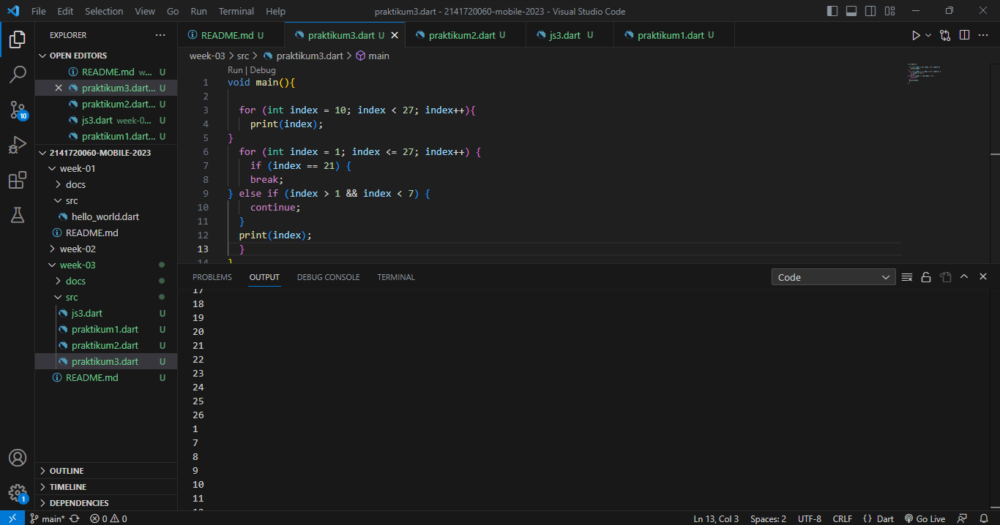
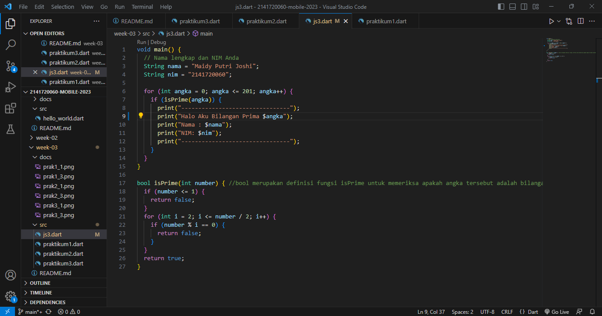
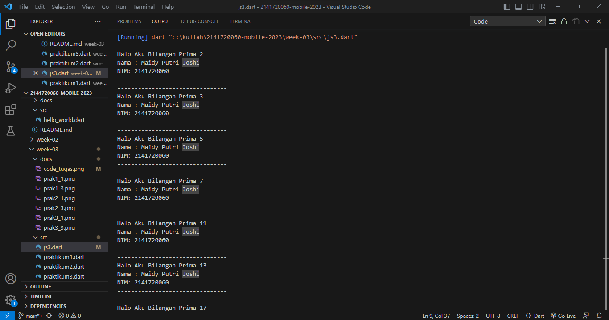
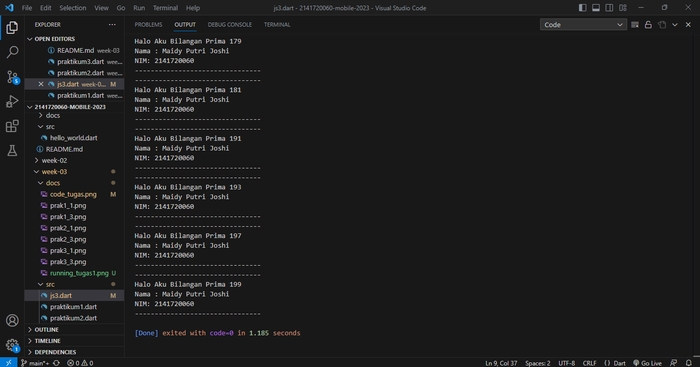

# TUGAS PRAKTIKUM PERTEMUAN 3

# NAMA: MAIDY PUTRI JOSHI

# NIM: 2141720060

1. Silakan selesaikan Praktikum 1 sampai 3, lalu dokumentasikan berupa screenshot hasil pekerjaan beserta penjelasannya!

Hasil Screenshoot:

A.  Praktikum 1 

- Langkah 1

- Langkah 2

Silakan coba eksekusi (Run) kode pada langkah 1 tersebut. Apa yang terjadi? Jelaskan!

Jawab: Kode program pada praktikum 1 langkah 1 adalah kode DART yang menggunakan struktur if, else if, dan else untuk menguji nilai dari variabel 'test'. 

Saya akan menjelaskan kode program pada baris atau line ke-10

pada, if (test == "test2") print("Test2 again"); >> Ini adalah pernyataan if yang terpisah setelah blok kondisional pertama. Ini memeriksa kembali apakah nilai test adalah "test2". Jika kondisi ini terpenuhi, maka pernyataan print akan dijalankan, dan hasilnya adalah mencetak "Test2 again". Maka, perlu diingat bahwa dalam kode ini, karena nilai test awalnya diatur sebagai "test2", maka kondisi dalam pernyataan if (test == "test2") di baris akhir akan terpenuhi, sehingga kedua pesan "Test2" dan "Test2 again" akan dicetak.

- Langkah 3

Tambahkan kode program berikut, lalu coba eksekusi (Run) kode Anda.

String test = "true";
if (test) {
   print("Kebenaran");
}

Apa yang terjadi ? Jika terjadi error, silakan perbaiki namun tetap menggunakan if/else.

Jawab:

Ya, terjadi error karena untuk menguji string "true" sebagai kondisi, namun kondisi dalam if statement seharusnya berupa ekspresi boolean (true atau false), bukan string. Jika Anda ingin menguji apakah string "true" adalah benar (true) atau salah (false), maka menggunakan toLowerCase() pada string test untuk memastikan bahwa pembandingannya bersifat case-insensitive.

B. Praktikum 2

- Langkah 1

Jawab:

- Langkah 2

Silakan coba eksekusi (Run) kode pada langkah 1 tersebut. Apa yang terjadi? Jelaskan! Lalu perbaiki jika terjadi error.

Jawab: Menambahkan inisialisasi awal untuk 'counter' yaitu int counter = 0; >>Lalu akan mencetak angka dari 0 hingga 32.

- Langkah 3

Apa yang terjadi ? Jika terjadi error, silakan perbaiki namun tetap menggunakan do-while.

Jawab: 

Tidak terjadi error.

Pertama, while loop akan mencetak nilai counter dari 0 hingga 32 (karena kondisinya adalah counter < 33).

Kemudian, do-while loop akan mencetak nilai counter dari nilai terakhirnya dalam while loop (yaitu 33) hingga 76 (karena kondisinya adalah counter < 77).

Sehingga hasil akhirnya adalah mencetak angka dari 0 hingga 76 ke konsol dalam urutan yang sesuai dengan kondisi loop.

C. Praktikum 3

- Langkah 1
 

- Langkah 2

Silakan coba eksekusi (Run) kode pada langkah 1 tersebut. Apa yang terjadi? Jelaskan! Lalu perbaiki jika terjadi error.

Jawab: Kode tersebut tidak benar masih ada typo pada Index yang seharusnya 'index' dan ada penambahan type data int agar bisa dijalankan.

- Langkah 3

Apa yang terjadi ? Jika terjadi error, silakan perbaiki namun tetap menggunakan for dan break-continue.

Jawab: Ya, terjadi error

Solusinya yaitu mengubah kondisi pada else if untuk menjadi (index > 1 && index < 7) agar sesuai dengan kondisi yang seharusnya. Dengan demikian, continue akan digunakan jika index berada di antara 2 hingga 6 (inklusif).

Sehingga output yang dimunculkan:
Loop akan berjalan dari 1 hingga 27 sehingga jika index mencapai 21, loop akan dihentikan (break).

Jika index berada di antara 2 hingga 6, maka iterasi tersebut akan dilewati (continue).
Untuk nilai index lainnya, nilai tersebut akan dicetak ke konsol.

# TUGAS PERTEMUAN 3
(File js3.dart)

2. Buatlah sebuah program yang dapat menampilkan bilangan prima dari angka 0 sampai 201 menggunakan Dart. Ketika bilangan prima ditemukan, maka tampilkan nama lengkap dan NIM Anda.

Hasil Screenshoot:

Kode Program:

Hasil Running:

