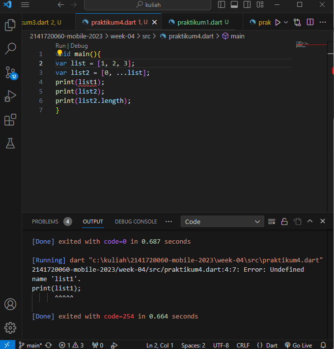
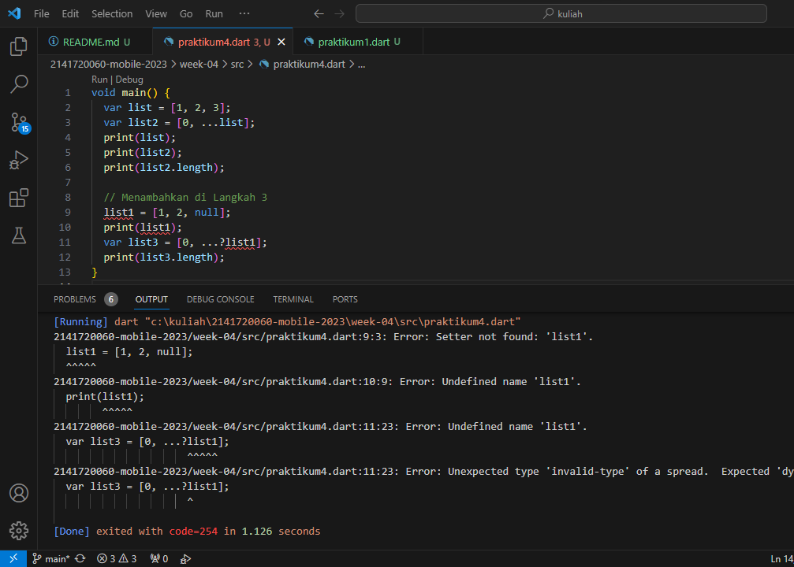

# TUGAS PRAKTIKUM PERTEMUAN 4
#### NAMA: MAIDY PUTRI JOSHI
#### NIM: 2141720060

## DAFTAR ISI:

#### - PRAKTIKUM1
#### - PRAKTIKUM2
#### - PRAKTIKUM3
#### - PRAKTIKUM4
#### - PRAKTIKUM5
#### - TUGAS PRAKTIKUM

## HASIL SCREENSHOOT PRAKTIKUM:

#### PRAKTIKUM 1
Langkah 1:

Langkah 2:

Silakan coba eksekusi (Run) kode pada langkah 1 tersebut. Apa yang terjadi? Jelaskan!

Jadi, keseluruhan kode program tersebut digunakan untuk mengilustrasikan penggunaan List, pernyataan 'assert' untuk memeriksa kondisi, dan pencetakan (print) nilai-nilai dari List tersebu

Langkah 3:

Ubah kode pada langkah 1 menjadi variabel final yang mempunyai index = 5 dengan default value = null. Isilah nama dan NIM Anda pada elemen index ke-1 dan ke-2. Lalu print dan capture hasilnya.

Apa yang terjadi ? Jika terjadi error, silakan perbaiki.

Jawab:

PERBAIKAN:

#### PRAKTIKUM 2

Langkah 1:

Langkah 2:

Silakan coba eksekusi (Run) kode pada langkah 1 tersebut. Apa yang terjadi? Jelaskan! Lalu perbaiki jika terjadi error.

Jawab:

Tidak terjadi error.

Langkah 3:

#### PRAKTIKUM 3

Langkah 1:

Langkah 2:

Silakan coba eksekusi (Run) kode pada langkah 1 tersebut. Apa yang terjadi? Jelaskan! Lalu perbaiki jika terjadi error.

Jawab: 

Tidak terjadi error.

Langkah 3:

Langkah 1:

Langkah 2:

Silakan coba eksekusi (Run) kode pada langkah 1 tersebut. Apa yang terjadi? Jelaskan! Lalu perbaiki jika terjadi error.

Jawab:

PERBAIKAN:

Pada print(list1) tidak akan terbaca karena belum di deklarasikan sebelumnya, jadi dihapus dan hanya ada variabel 'list' sekarang dideklarasikan dengan nama list dan bukan list1.

Langkah 3:

Apa yang terjadi ? Jika terjadi error, silakan perbaiki.

Tambahkan variabel list berisi NIM Anda menggunakan Spread Operators. Dokumentasikan hasilnya dan buat laporannya!

Jawab:

Ya, terjadi error karena kode yang menyebabkan error pada 'list1 = [1, 2, null];'

yang akan diperbaiki dengan mendeklarasikan variabel list1 dengan tipe data var. Dengan itu memungkinkan penggunaan list1 dalam kode selanjutnya.

PERBAIKAN:

Langkah 4:

Apa yang terjadi ? Jika terjadi error, silakan perbaiki. Tunjukkan hasilnya jika variabel promoActive ketika true dan false.

Jawab:

PERBAIKAN:

Seharusnya diperlukan pendeklarasian untuk if true or false

Langkah 5:

Jawab:

Perbaikannya dengan memberikan nilai 'Manager' ke variabel login untuk menunjukkan bahwa 'Inventory' akan disertakan dalam nav2.

Langkah 6:

Jawab:

Tidak terjadi error, lalu manfaat collection fornya

Sebagai pembuatan List baru yaitu pada baris kedua, dengan menggunakan "Collection for" untuk membuat list baru listOfStrings. Dalam ekspresi for, setiap elemen i dari listOfInts digunakan untuk membangun string baru dengan format '#$i'.

Maka hasilnya adalah list listOfStrings yang berisi elemen-elemen berdasarkan nilai-nilai dalam listOfInts.
Apabila tanpa "Collection for," maka harus menulis perulangan manual dan membuat list dengan lebih banyak kode.

Dengan "Collection for," kita tidak perlu melakukan iterasi manual atau menginisialisasi list kosong dan mengisi elemen-elemennya satu per satu. Sehingga membuat kode lebih efisien dan mengurangi risiko kesalahan.

### PRAKTIKUM 5

Langkah 1:

Jawab:

Langkah 2:

Jawab:

Ya, terjadi error karena kurang menambahi ';'
PERBAIKAN:

Langkah 3:

Apa yang terjadi ? Jika terjadi error, silakan perbaiki. Gunakan fungsi tukar() di dalam main() sehingga tampak jelas proses pertukaran value field di dalam Records.

Jawab:

Tidak terjadi error saat melakukan running.

fungsi tukar() di dalam main():

Langkah 4:

Apa yang terjadi ? Jika terjadi error, silakan perbaiki. Inisialisasi field nama dan NIM Anda pada variabel record mahasiswa di atas. Dokumentasikan hasilnya dan buat laporannya!

Jawab:

Ya, terjadi error karena belum diinisialisasikan fieldnya.

PERBAIKAN:

Langkah 5:

Gantilah salah satu isi record dengan nama dan NIM Anda, lalu dokumentasikan hasilnya dan buat laporannya!

# TUGAS PRAKTIKUM (PPT)

1. Jelaskan yang dimaksud Functions dalam bahasa Dart!

Jawab:

Dart adalah bahasa berorientasi objek yang sebenarnya, sehingga fungsi pun adalah objek dan memiliki tipe, Function. Ini berarti bahwa fungsi dapat ditetapkan ke variabel atau diteruskan sebagai argumen ke fungsi lain. Anda juga dapat memanggil instance dari kelas Dart seolah-olah itu adalah fungsi. Untuk detailnya, lihat Objek yang dapat dipanggil.

2. Jelaskan jenis-jenis parameter di Functions beserta contoh sintaksnya!

Jawab:

Dalam pemrograman Dart, ada jenis parameter yang dapat digunakan dalam definisi fungsi. Berikut adalah jenis-jenis parameter di Dart beserta contoh sintaksnya:

-**Required Parameters**, Parameter yang diperlukan dalam Dart adalah parameter yang harus diberikan saat memanggil fungsi tersebut dengan cara mendeklarasikannya langsung dalam tanda kurung parameter fungsi itu.

    - Sintaks:
    void printName(String name) {
    print('Nama: $name');
    }

-**Optional Parameter**, Parameter opsional memungkinkan kita untuk memanggil fungsi dengan atau tanpa memberikan nilai untuk parameter.

    - Sintaks:
    void greet(String name, {String greeting = 'Halo'}) {
        print('$greeting, $name!');
        }

untuk memanggil fungsi greet:

    - Sintaks:
    greet('Maidy');
    greet('Ris', greeting: 'Hi');

-**Positional Parameters**, Parameter yang diberikan berdasarkan posisinya. Anda dapat memanggil fungsi dengan mengabaikan parameter opsional atau mengisi parameter opsional dalam urutan yang benar.

    -Sintaks:
    void addNumbers(int a, int b) {
        print('Hasil penjumlahan: ${a + b}');
    }

untuk memanggil fungsi addNumbers:

    - Sintaks:
    addNumbers(3, 5); // Output: 'Hasil penjumlahan: 8'

3. Jelaskan maksud Functions sebagai first-class objects beserta contoh sintaknya!

Jawab:

Dalam Dart, "functions as first-class objects" adalah konsep yang mengacu pada kemampuan untuk memperlakukan fungsi sama seperti tipe data lainnya, seperti int, string, atau objek. Ini berarti fungsi dapat:

- Menyimpan Fungsi dalam Variabel
- Melewatkan Fungsi sebagai Argumen
- Mengembalikan Fungsi dari Fungsi Lain
- Dikembalikan sebagai Nilai dari Daftar atau Map

Contoh sintaksnya:

    void printElement(int element) {
        print(element);
    }
    var list = [1, 2, 3];
    //Pass printElement sebagai parameter.
    list.forEach(printElement);

4. Apa itu Anonymous Functions? Jelaskan dan berikan contohnya!

Jawab:

Sebagian besar fungsi diberi nama, seperti main() atau printElement(). Anda juga dapat membuat fungsi tanpa nama yang disebut fungsi anonim atau Anonymous, atau terkadang lambda atau closure. Jadi kita dapat menetapkan fungsi anonim ke sebuah variabel sehingga, misalnya, kita dapat menambahkan atau menghapusnya dari koleksi.

Fungsi anonim atau Anonymous terlihat mirip dengan fungsi bernama-nol atau lebih parameter, dipisahkan dengan koma dan anotasi tipe opsional, di antara tanda kurung.

        // Anonymous function tanpa parameter
        var sayHello = () {
            print('Hello, world!');
        };
        
        // Memanggil anonymous function
        sayHello(); // Output: Hello, world!

5. Jelaskan perbedaan Lexical scope dan Lexical closures! Berikan contohnya!

Jawab:

Jadi, perbedaan utama adalah 

- **Lexical scope** dalam Dart **mengacu pada aturan tentang bagaimana variabel diidentifikasi berdasarkan tempat deklarasi variabel dalam kode**. Sedangkan **Lexical closures** dalam Dart **terjadi ketika sebuah fungsi (biasanya disebut sebagai fungsi dalam) mengakses variabel dari lingkup luar dan "mengingat" nilai-nilai variabel tersebut** bahkan setelah fungsi luar selesai dieksekusi.

-  **Lexical scope** variabel yang dideklarasikan dalam suatu blok kode, seperti dalam sebuah fungsi, hanya dapat diakses dalam blok kode tersebut atau dalam blok-blok kode bersarang yang lebih dalam. Sedangkan **Lexical closures** Fungsi dalam yang memiliki penutupan leksikal dapat mengakses dan menggunakan variabel-variabel dari lingkup luar, bahkan setelah lingkup luar sudah selesai dieksekusi.

Contohnya:

- **Lexical scope**

        bool topLevel = true;
        void main() {
            var insideMain = true;
            void myFunction() {
        var insideFunction = true;
        void nestedFunction() {
        var insideNestedFunction = true;

      assert(topLevel);
      assert(insideMain);
      assert(insideFunction);
      assert(insideNestedFunction);
            }
        }
    }

Kode di atas menggambarkan, tentang ruang lingkup variabel dalam fungsi dart dan bagaimana ruang lingkupnya
berakhir di luar kurung.

Kode kemudian menggunakan pernyataan assert untuk memeriksa apakah variabel-variabel tersebut memiliki nilai true di dalam lingkup mereka masing-masing. Namun, fungsi-fungsi tersebut tidak pernah dipanggil, sehingga kode di dalamnya tidak pernah dieksekusi dalam program ini.

- **Lexical closures**

        /// Returns a function that adds [addBy] to the
        /// function's argument.
        
        Function makeAdder(int addBy) {
            return (int i) => addBy + i;
        }
        
        void main() {
            // Create a function that adds 2.
            var add2 = makeAdder(2);
            // Create a function that adds 4.
            var add4 = makeAdder(4);
            assert(add2(3) == 5);
            assert(add4(3) == 7);
        }

Fungsi dapat menutup variabel yang didefinisikan dalam lingkup sekitarnya. Dalam contoh berikut ini, makeAdder() menangkap variabel addBy. Kemanapun fungsi yang dikembalikan pergi, fungsi tersebut akan mengingat variabel "add".

6. Jelaskan dengan contoh cara membuat return multiple value di Functions!

Jawab:

        class Mahasiswa {
            int a;
            int b;
            int c;
            
            Mahasiswa(this.a, this.b, this.c);
        }
        
        Mahasiswa getValues() {
            int a = 10;
            int b = 20;
            int c = 30;
        
        return Mahasiswa(a, b, c);
        }
        
        void main() {
            Mahasiswa values = getValues();
            print('First Value: ${values.a}');
            print('Second Value: ${values.b}');
            print('Third Value: ${values.c}');
        }

Dalam contoh ini, kita membuat sebuah kelas Mahasiswa yang memiliki tiga properti (a, b, dan c). Fungsi getValues() mengembalikan objek dari kelas ini dengan nilai-nilai yang sesuai. Kemudian, dalam main(), kita dapat mengakses nilai-nilai tersebut melalui properti objek values.

