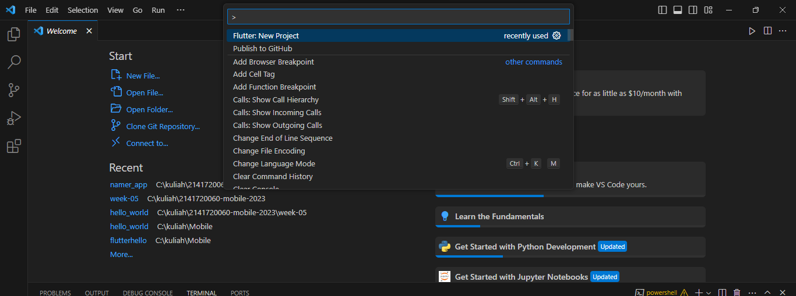
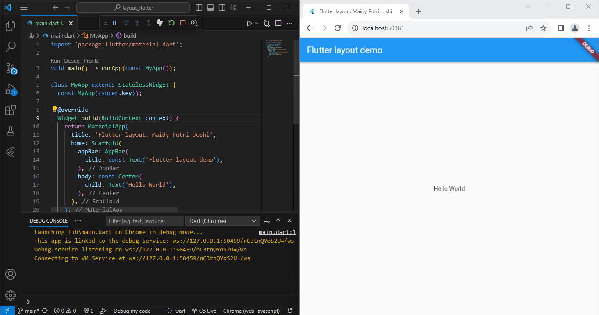
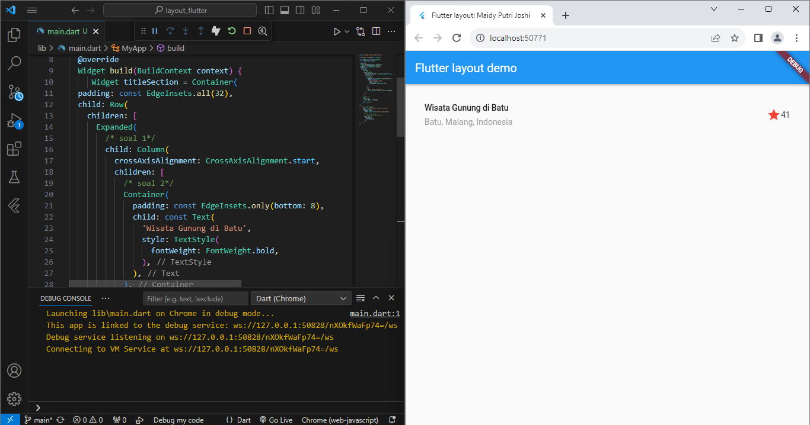
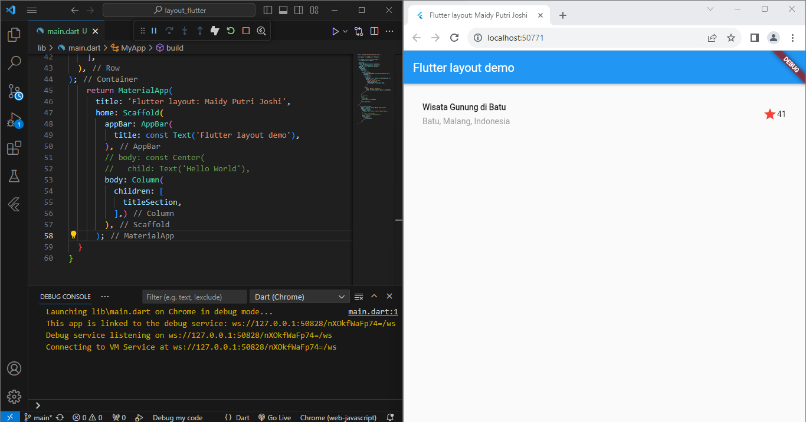
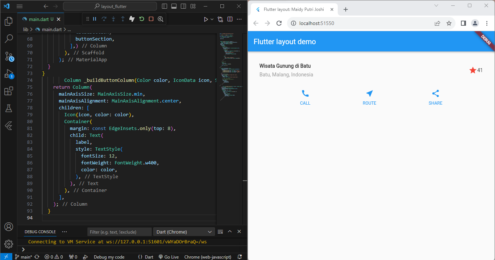
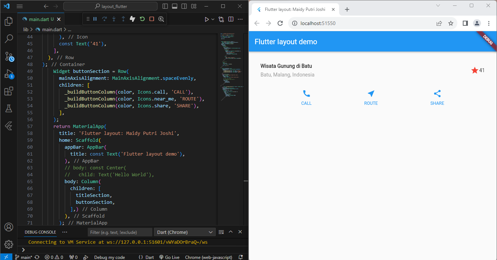
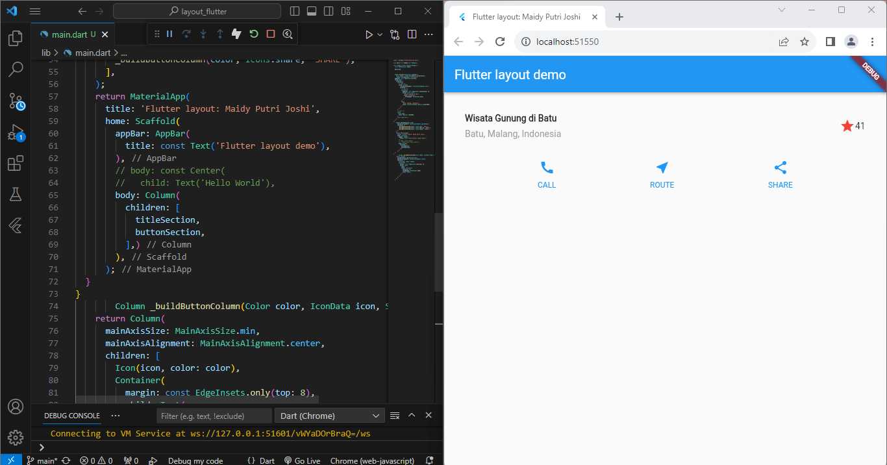
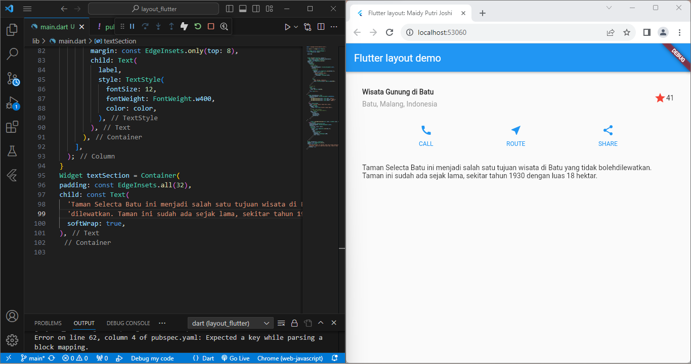
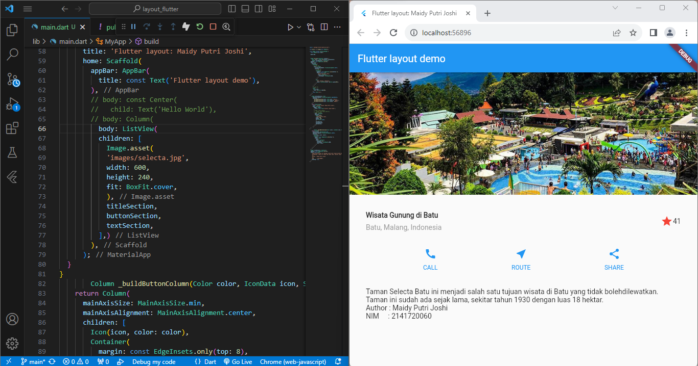
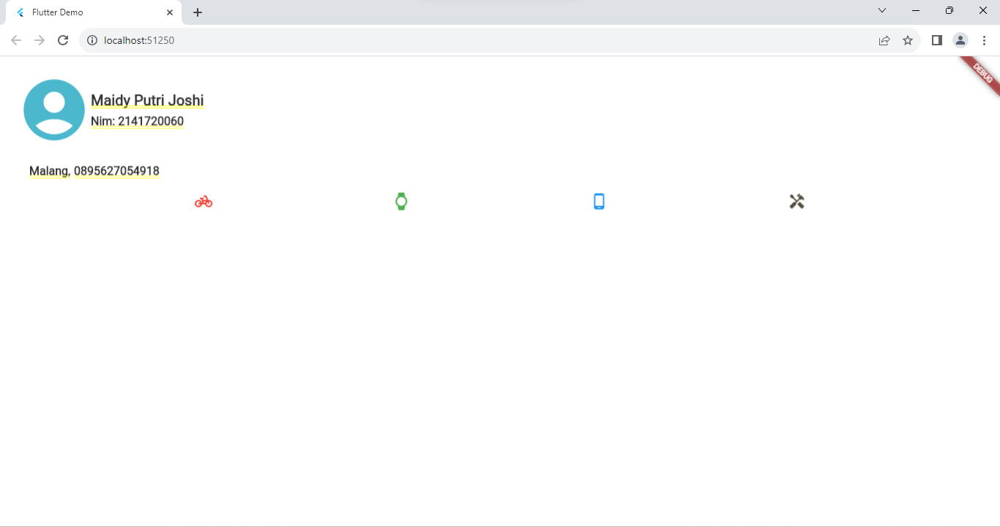

# layout_flutter

A new Flutter project.

## Getting Started

This project is a starting point for a Flutter application.

A few resources to get you started if this is your first Flutter project:

- [Lab: Write your first Flutter app](https://docs.flutter.dev/get-started/codelab)
- [Cookbook: Useful Flutter samples](https://docs.flutter.dev/cookbook)

For help getting started with Flutter development, view the
[online documentation](https://docs.flutter.dev/), which offers tutorials,
samples, guidance on mobile development, and a full API reference.

# TUGAS PRAKTIKUM:
-------

1. Selesaikan Praktikum 1 sampai 4, lalu dokumentasikan dan push ke repository Anda berupa screenshot setiap hasil pekerjaan beserta penjelasannya di file README.md!

hasil Screenshoot:
### PRAKTIKUM 1 - Membangun Layout di Flutter

Langkah 1:

Buatlah sebuah project flutter baru dengan nama layout_flutter. Atau sesuaikan style laporan praktikum yang Anda buat.

Langkah 2:

Buka file main.dart lalu ganti dengan kode berikut. Isi nama dan NIM Anda di text title.

Langkah 3:

Identifikasi layout diagram

Langkah 4:

Pertama, Anda akan membuat kolom bagian kiri pada judul. Tambahkan kode berikut di bagian atas metode build() di dalam kelas MyApp:

### PRAKTIKUM 2 - Implementasi button row

Langkah 1:

Buat method Column _buildButtonColumn

Langkah 2:

Buat widget buttonSection

Langkah 3:

Tambah button section ke body

### PRAKTIKUM 3 - Implementasi text section

Langkah 1:

Buat widget textSection, Tambahkan variabel text section ke body

### PRAKTIKUM 4 -Implementasi image section

Langkah 1:

Siapkan aset gambar

Langkah 2:

Tambahkan gambar ke body

Langkah 3:

Terakhir, ubah menjadi ListView

2. Silakan implementasikan di project baru "basic_layout_flutter" dengan mengakses sumber ini: https://docs.flutter.dev/codelabs/layout-basics

3. Kumpulkan link commit repository GitHub Anda ke spreadsheet yang telah disediakan!