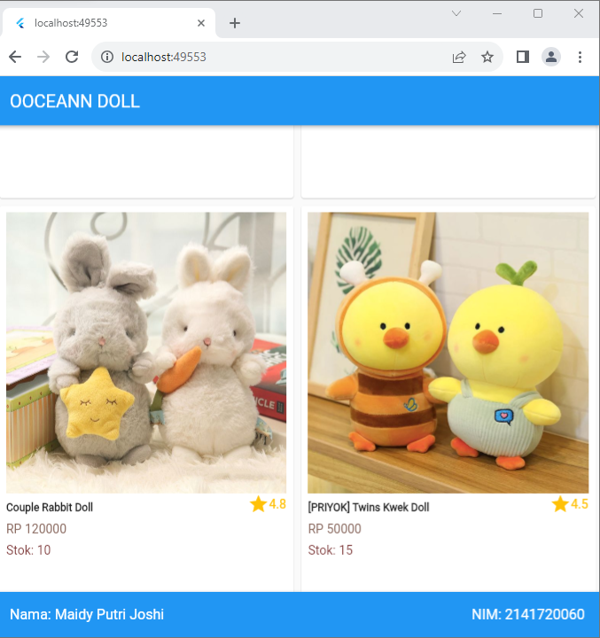

# PRAKTIKUM NAVIGASI belanja
## Nama : Maidy Putri Joshi
## NIM  : 2141720060
## Kelas: TI-3F

A new Flutter project.

## Getting Started

This project is a starting point for a Flutter application.

A few resources to get you started if this is your first Flutter project:

- [Lab: Write your first Flutter app](https://docs.flutter.dev/get-started/codelab)
- [Cookbook: Useful Flutter samples](https://docs.flutter.dev/cookbook)

For help getting started with Flutter development, view the
[online documentation](https://docs.flutter.dev/), which offers tutorials,
samples, guidance on mobile development, and a full API reference.

HASIL SCREENSHOOT:

## Langkah 1: Siapkan project baru

## Langkah 2: Mendefinisikan Route

## Langkah 3: Lengkapi Kode di main.dart

## Langkah 4: Membuat data model

## Langkah 5: Lengkapi kode di class HomePage

## Langkah 6: Membuat ListView dan itemBuilder

## Langkah 7: Menambahkan aksi pada ListView

- Pembacaan nilai yang dikirimkan pada halaman sebelumnya dapat dilakukan menggunakan ModalRoute. Tambahkan kode berikut pada blok fungsi build dalam halaman ItemPage. Setelah nilai didapatkan, anda dapat menggunakannya seperti penggunaan variabel pada umumnya.

Hasil Running:

### Hasil .gif:

TUGAS:

