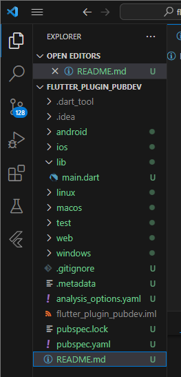
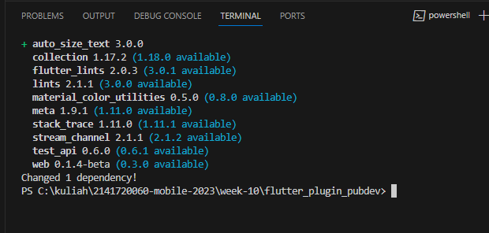
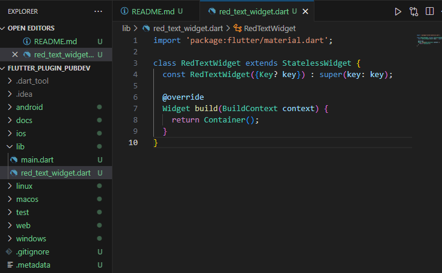
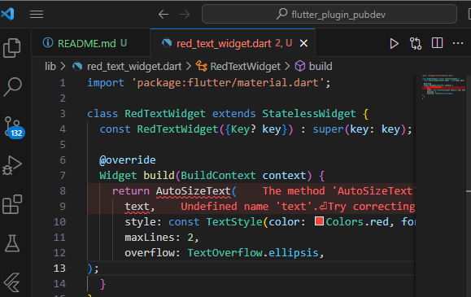
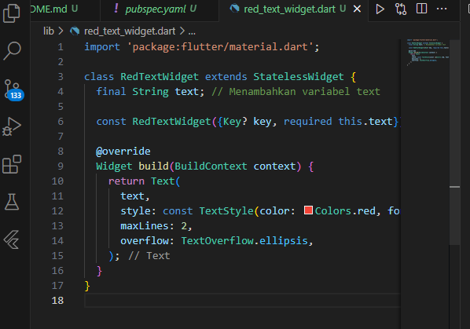
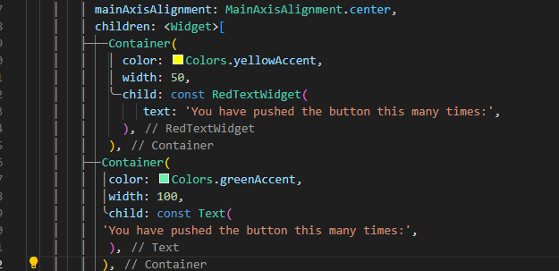
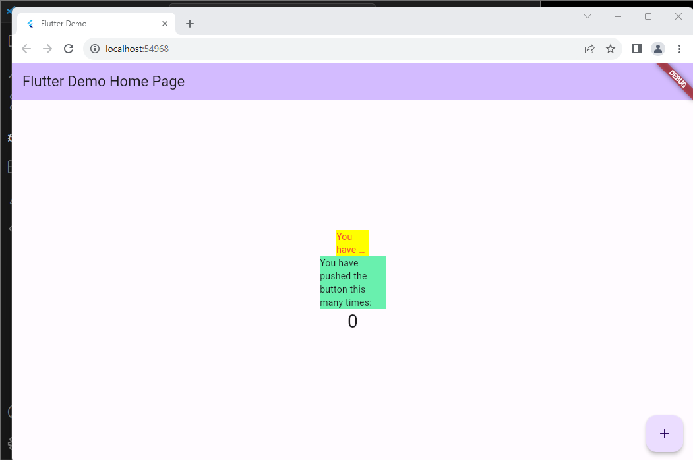

# flutter_plugin_pubdev
# Praktikum Mobile TI-3F
### Nama: Maidy Putri Joshi
### NIM: 2141720060

Selesaikan Praktikum tersebut, lalu dokumentasikan dan push ke repository Anda berupa screenshot hasil pekerjaan beserta penjelasannya di file README.md!

Hasil Screenshoot:

Langkah 1: Buat Project Baru

Buatlah sebuah project flutter baru dengan nama flutter_plugin_pubdev. Lalu jadikan repository di GitHub Anda dengan nama flutter_plugin_pubdev.

Langakh 2: Menambahkan Plugin

Tambahkan plugin auto_size_text menggunakan perintah berikut di terminal

     flutter pub add auto_size_text

Langkah 3: Buat file red_text_widget.dart

Buat file baru bernama red_text_widget.dart di dalam folder lib lalu isi kode seperti berikut.

    import 'package:flutter/material.dart';
    class RedTextWidget extends StatelessWidget {
        const RedTextWidget({Key? key}) : super(key: key);
    @override
    Widget build(BuildContext context) {
    return Container();
      }
    }

Langkah 4: Tambah Widget AutoSizeText

Masih di file red_text_widget.dart, untuk menggunakan plugin auto_size_text, ubahlah kode return Container() menjadi seperti berikut.

     return AutoSizeText(
      text,
      style: const TextStyle(color: Colors.red, fontSize: 14),
      maxLines: 2,
      overflow: TextOverflow.ellipsis,
    );

Setelah Anda menambahkan kode di atas, Anda akan mendapatkan info error. Mengapa demikian? Jelaskan dalam laporan praktikum Anda!

Jawab:
- widget AutoSizeText tanpa mendefinisikan atau mengimpor kelas tersebut. Untuk menggunakan AutoSizeText
- Kesalahan dalam Penggunaan text, yaitu terdapat pemanggilan variabel text dalam AutoSizeText yang tidak didefinisikan dalam kelas RedTextWidget

Langkah 5: Buat Variabel text dan parameter di constructor

Tambahkan variabel text dan parameter di constructor seperti berikut.

final String text;

    final String text;
    const RedTextWidget({Key? key, required this.text}) : super(key: key);

Langkah 6: Tambahkan widget di main.dart

Buka file main.dart lalu tambahkan di dalam children: pada class _MyHomePageState

     Container(
        color: Colors.yellowAccent,
        width: 50,
        child: const RedTextWidget(
             text: 'You have pushed the button this many times:',
          ),
    ),
    
    Container(
    color: Colors.greenAccent,
    width: 100,
    child: const Text(
           'You have pushed the button this many times:',
          ),
    ),

2. Jelaskan maksud dari langkah 2 pada praktikum tersebut!
- Jawab:
Langkah flutter pub add auto_size_text merupakan perintah yang digunakan dalam Flutter untuk menambahkan atau menginstal paket auto_size_text ke dalam proyek Flutter 

3. Jelaskan maksud dari langkah 5 pada praktikum tersebut!
- Jawab:
Kode tersebut mencakup deklarasi variabel text, yang seharusnya hanya dideklarasikan sekali dalam kelas RedTextWidget. Selain itu, kode menentukan sebuah konstruktor yang membutuhkan parameter wajib text dan parameter opsional key, yang digunakan untuk membuat instance dari kelas RedTextWidget dengan memberikan nilai teks yang akan ditampilkan. Variabel text digunakan untuk menampilkan teks di dalam widget yang sedang dibuat.

4. Pada langkah 6 terdapat dua widget yang ditambahkan, jelaskan fungsi dan perbedaannya!
- Jawab:
- a. Container pertama, fungsinya untuk menetapkan warna latar belakang kuning (Colors.yellowAccent) dengan lebar 50 piksel, dan memiliki RedTextWidget sebagai child di dalamnya **Sedangkan**
Container kedua, fungsinya mengatur warna dengan latar belakang hijau (Colors.greenAccent) dan lebar 100 piksel. Widget Text yang digunakan di sini untuk menampilkan teks, "You have pushed the button this many times:"

Jadi, perbedaan di antara keduanya adalah bahwa RedTextWidget merupakan custom widget yang telah didefinisikan sebelumnya, sedangkan Text adalah widget bawaan Flutter yang digunakan untuk menampilkan teks dengan gaya dan format yang umum.

Untuk fungsi container sama-sama mengatur background color dan lebarnya.

5. Jelaskan maksud dari tiap parameter yang ada di dalam plugin auto_size_text berdasarkan tautan pada dokumentasi ini !

- Jawab:

- text: Parameter ini mengacu pada teks yang akan ditampilkan oleh widget AutoSizeText. Saat menggunakan text, Anda harus memberikan nilai teks yang ingin ditampilkan, misalnya, "Hello, World!".

- style: Menentukan gaya atau style dari teks yang ditampilkan, termasuk properti seperti warna teks (dalam contoh ini, digunakan warna merah), ukuran font, dll. Di sini, digunakan TextStyle dengan warna merah dan ukuran font 14.

- maxLines: Parameter ini menentukan jumlah maksimal baris yang teks akan tampilkan. Jika teks melebihi jumlah maksimum baris yang ditentukan, maka teks tersebut akan dipotong atau ditambahkan elipsis (...).

- overflow: Menentukan tindakan yang harus dilakukan jika teks melebihi batas yang ditentukan oleh maxLines. Pada contoh ini, jika teks melebihi dua baris (karena maxLines disetel ke 2), maka teks akan dipotong dengan elipsis.

A new Flutter project.

## Getting Started

This project is a starting point for a Flutter application.

A few resources to get you started if this is your first Flutter project:

- [Lab: Write your first Flutter app](https://docs.flutter.dev/get-started/codelab)
- [Cookbook: Useful Flutter samples](https://docs.flutter.dev/cookbook)

For help getting started with Flutter development, view the
[online documentation](https://docs.flutter.dev/), which offers tutorials,
samples, guidance on mobile development, and a full API reference.
