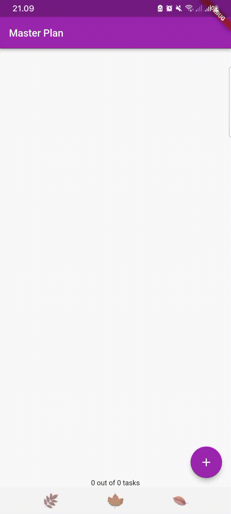

# TUGAS PRAKTIKUM PERTEMUAN 11
#### NAMA: MAIDY PUTRI JOSHI
#### NIM: 2141720060
#### Kelas: TI-3F

# Praktikum 1:

1. Selesaikan langkah-langkah praktikum tersebut, lalu dokumentasikan berupa GIF hasil akhir praktikum beserta penjelasannya di file README.md!

Hasil screenshoot:

2. Jelaskan maksud dari langkah 4 pada praktikum tersebut! Mengapa dilakukan demikian?
- Jawab: Untuk melakukan proses ekspor dari model-model yang ada. Jadi, kode tersebut berisi perintah export untuk mengekspor dua file lain yang mungkin berisi definisi dari model-model, yaitu plan.dart dan task.dart. Sehingga memudahkan pengelolaan ketergantungan antar file dalam project.

3. Mengapa perlu variabel plan di langkah 6 pada praktikum tersebut? Mengapa dibuat konstanta ?
- Jawab:

- a. Representasi Data, Plan mungkin merupakan representasi dari data rencana yang dibutuhkan untuk ditampilkan di layar PlanScreen. Dengan menginisialisasi variabel plan di awal, kita dapat mempersiapkan data yang diperlukan untuk tampilan sebelum PlanScreen ditampilkan.

- b. Memisahkan Logika dan Tampilan, Penggunaan Plan di sini mungkin dimaksudkan untuk memisahkan logika data dari tampilan. Ini memungkinkan pengelolaan data terpisah dari tampilan yang disajikan kepada pengguna.
-  **Jika data rencana yang ditampilkan dalam PlanScreen akan berubah atau diambil dari sumber data yang dinamis, maka penggunaan const mungkin perlu untuk direvisi agar sesuai dengan kebutuhan**

4. Lakukan capture hasil dari Langkah 9 berupa GIF, kemudian jelaskan apa yang telah Anda buat!
Jawab: 

5. Apa kegunaan method pada Langkah 11 dan 13 dalam lifecyle state ?
Jawab:
- **Langkah 11**: method initState() dipanggil tepat setelah widget diinisialisasi. Method ini digunakan untuk melakukan inisialisasi atau konfigurasi awal pada saat widget dibuat.
Pada kode program, di dalam method initState(), scrollController diinisialisasi sebagai ScrollController dan kemudian sebuah listener ditambahkan dengan menggunakan addListener.
- **Langkah 13**: method dispose() dipanggil ketika widget Stateful dihancurkan, yaitu ketika widget tidak lagi dibutuhkan atau dihilangkan dari tampilan.
Pada kode program, di dalam method dispose(), scrollController.dispose() dipanggil untuk membersihkan dan membebaskan sumber daya yang digunakan oleh scrollController.

6. Kumpulkan laporan praktikum Anda berupa link commit atau repository GitHub ke spreadsheet yang telah disediakan!

# Praktikum 2:
1. Selesaikan langkah-langkah praktikum tersebut, lalu dokumentasikan berupa GIF hasil akhir praktikum beserta penjelasannya di file README.md!

Hasil screenshoot:

2. Jelaskan mana yang dimaksud InheritedWidget pada langkah 1 tersebut! Mengapa yang digunakan InheritedNotifier?
- Jawab: InheritedWidget dalam Flutter adalah mekanisme untuk menyebarkan data ke dalam pohon widget, memungkinkan widget-widget di bawahnya untuk mengakses data tersebut tanpa perlu disediakan secara langsung.

- Sementara itu, InheritedNotifier adalah turunan dari InheritedWidget yang juga mengintegrasikan mekanisme notifikasi perubahan (ValueNotifier dalam hal ini) ke widget-widget yang menerima data. Ini memungkinkan pembaruan tampilan (UI) saat data yang diwariskan berubah, tanpa memerlukan penyampaian data secara manual. Widget-widget yang menggunakan InheritedNotifier akan diperbarui secara otomatis saat data yang diawariskan berubah.

- Jadi, InheritedNotifier adalah cara yang efisien untuk mewariskan data dan memberitahu widget-widget terkait tentang perubahan data yang terjadi.

3. Jelaskan maksud dari method di langkah 3 pada praktikum tersebut! Mengapa dilakukan demikian?
- Jawab: 
Method completedCount menghitung jumlah tugas yang sudah selesai dalam daftar tugas, sementara completenessMessage memberikan pesan yang menampilkan jumlah tugas yang sudah selesai dari total tugas yang harus diselesaikan dalam rencana. Ini memberikan informasi jelas tentang kemajuan rencana kepada pengguna.

4. Lakukan capture hasil dari Langkah 9 berupa GIF, kemudian jelaskan apa yang telah Anda buat!

5. Kumpulkan laporan praktikum Anda berupa link commit atau repository GitHub ke spreadsheet yang telah disediakan!

# Praktikum 3:

1. Selesaikan langkah-langkah praktikum tersebut, lalu dokumentasikan berupa GIF hasil akhir praktikum beserta penjelasannya di file README.md!

2. Berdasarkan Praktikum 3 yang telah Anda lakukan, jelaskan maksud dari gambar diagram berikut ini!

- Jawab: Diagram tersebut adalah widget tree dari Flutter. Dimana semua elemen tersebut adalah objek abadi yang menggambarkan bagaimana UI harus terlihat dan berperilaku. Dan widget tree adalah struktur hierarkis widget yang menentukan tata letak dan tampilan aplikasi.

Dalam diagram di atas, widget MaterialApp memiliki tiga widget turunan yaitu **PlanProvider, PlanCreatorScreen, dan PlanScreen.**
- **PlanProvider** adalah widget yang menggunakan paket Provider untuk mengelola status aplikasi. Ini memungkinkan widget lain untuk mengakses dan memperbarui data yang terkait dengan rencana yang dibuat oleh pengguna atau user.
- PlanCreatorScreen dan PlanScreen adalah widget yang mewakili layar aplikasi yang berbeda. **PlanCreatorScreen** adalah layar tempat pengguna dapat membuat paket baru dengan memasukkan beberapa detail dan memilih beberapa opsi. **PlanScreen** adalah layar tempat pengguna dapat melihat detail paket yang ada dan mengedit atau menghapusnya.

Dalam diagram di atas, metode Navigator.push digunakan untuk menavigasi dari PlanCreatorScreen ke PlanScreen saat pengguna click plan cardnya. Metode Navigator.pop digunakan untuk menavigasi kembali dari PlanScreen ke PlanCreatorScreen saat pengguna mengetuk tombol kembali.

3. Lakukan capture hasil dari Langkah 14 berupa GIF, kemudian jelaskan apa yang telah Anda buat!

4. Kumpulkan laporan praktikum Anda berupa link commit atau repository GitHub ke spreadsheet yang telah disediakan!

https://github.com/maidyjoshi/2141720060-mobile-2023

