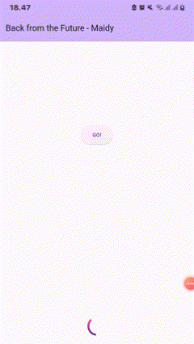
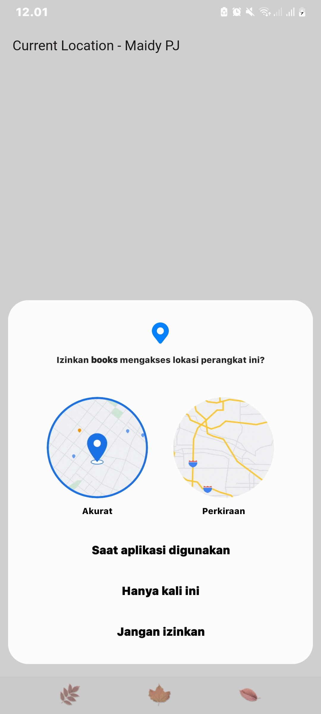
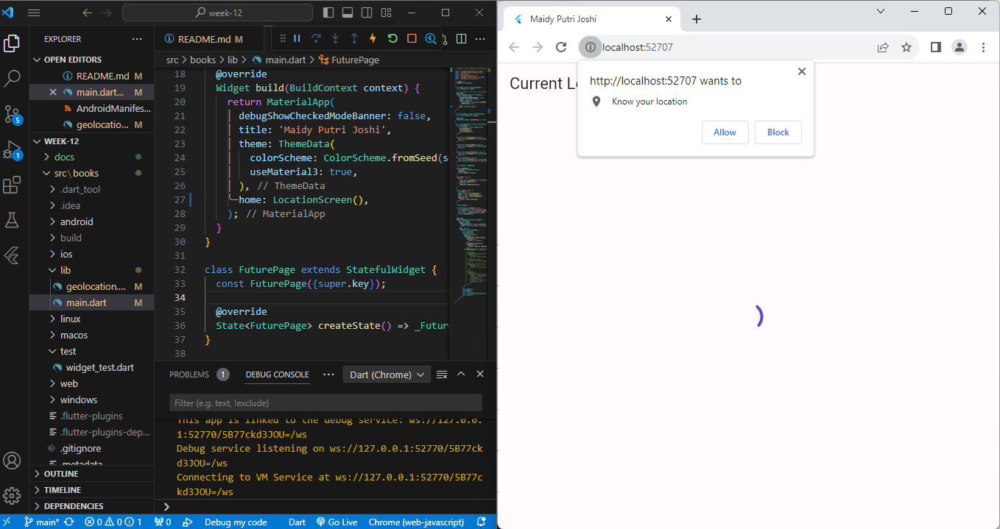
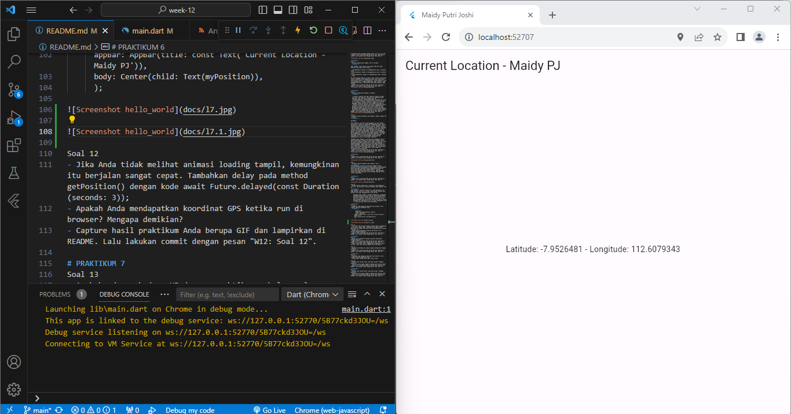
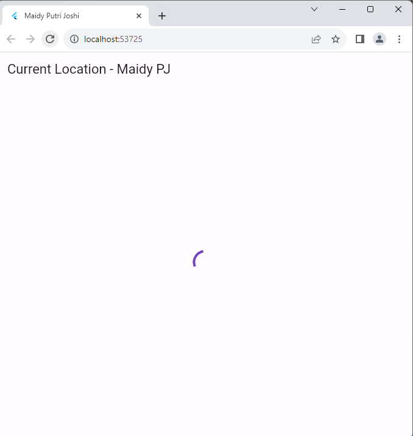
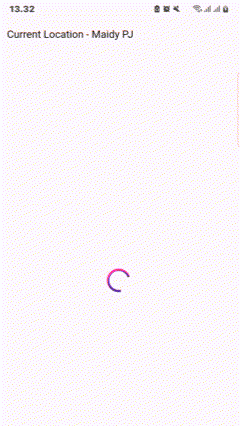

# PRAKTIKUM 12

## NAMA: MAIDY PUTRI JOSHI
## NIM: 2141720060
## KELAS: TI-3F

# PRAKTIKUM 1

Soal 1
- Tambahkan nama panggilan Anda pada title app sebagai identitas hasil pekerjaan Anda.

Soal 2
- Carilah judul buku favorit Anda di Google Books, lalu ganti ID buku pada variabel path di kode tersebut. Caranya ambil di URL browser Anda seperti gambar berikut ini.
- Kemudian cobalah akses di browser URI tersebut dengan lengkap seperti ini. Jika menampilkan data JSON, maka Anda telah berhasil. Lakukan capture milik Anda dan tulis di README pada laporan praktikum. Lalu lakukan commit dengan pesan "W12: Soal 2".

Soal 3
- Jelaskan maksud kode langkah 5 tersebut terkait substring dan catchError!
- **Jawaban:**

Pada substring() mengambil substring dari string, dimana metode ini menerima dua parameter, yaitu indeks awal dan indeks akhir. Sedangkan metode catchError() menangani kesalahan dan menerima satu parameter, yaitu fungsi yang akan dijalankan jika terjadi kesalahan. jadi substring() digunakan oleh kode di atas untuk mengambil 450 karakter pertama dari respons API. Jika terjadi kesalahan saat mengambil respons API, kode tersebut akan menggunakan catchError() untuk menampilkan pesan kesalahan dengan judul "An error occurred"
- Capture hasil praktikum Anda berupa GIF dan lampirkan di README. Lalu lakukan commit dengan pesan "W12: Soal 3".

# PRAKTIKUM 2
Soal 4
- Jelaskan maksud kode langkah 1 dan 2 tersebut!
- **Jawaban:**

Pada langkah 1 dari kode di atas adalah kode Dart yang memiliki tiga fungsi return Async:

- returnOneAsync() Fungsi ini mengembalikan nilai 1 setelah 3 detik.
- returnTwoAsync() Fungsi ini mengembalikan nilai 2 setelah 3 detik.
- returnThreeAsync() Fungsi ini mengembalikan nilai 3 setelah 3 detik.

Dan pada langkah kedua dari kode di atas, fungsi asynchronous count() digunakan untuk menghitung jumlah dari tiga fungsi asynchronous lainnya: returnOneAsync(), returnTwoAsync(), dan returnThreeAsync(). Dengan menggunakan fungsi count(), yang mengembalikan Future, eksekusinya tidak akan memblokir kode lainnya.
- Capture hasil praktikum Anda berupa GIF dan lampirkan di README. Lalu lakukan commit dengan pesan "W12: Soal 4".

# PRAKTIKUM 3
Soal 5
- Jelaskan maksud kode langkah 2 tersebut!
- **Jawaban:**

  - Variabel completer Variabel completer adalah variabel late dari tipe Completer. Variabel ini digunakan untuk menyimpan hasil dari perhitungan angka 42.
  - Method getNumber() Method getNumber() mengembalikan nilai dari variabel completer. Method ini memiliki dua langkah: a. Inisialisasi variabel completer dengan nilai baru. b. Memanggil method calculate() untuk menghitung angka 42.
  - Method calculate() Method calculate() menggunakan Future.delayed() untuk menunggu 5 detik sebelum menyelesaikan perhitungan angka 42. Setelah 5 detik, method ini akan memanggil method completer.complete() untuk menyelesaikan perhitungan dan mengembalikan nilai 42 ke variabel completer
- Capture hasil praktikum Anda berupa GIF dan lampirkan di README. Lalu lakukan commit dengan pesan "W12: Soal 5".

Soal 6
- Jelaskan maksud perbedaan kode langkah 2 dengan langkah 5-6 tersebut!
- **Jawaban:**

Perbedaan:

Pada langkah 5, perintah untuk mengganti isi dari method calculate(). Metode ini sebelumnya menggunakan await Future.delayed(const Duration(seconds: 5)); untuk menunggu 5 detik sebelum menyelesaikan perhitungan angka 42. Namun, metode ini tidak menangani kesalahan yang mungkin terjadi saat menunggu 5 detik. Sebaliknya, kode ini menggunakan try/catch untuk menangani kesalahan yang mungkin terjadi saat menunggu 5 detik. Jika tidak ada kesalahan, metode ini akan memanggil metode completer.complete() untuk menyelesaikan perhitungan dan mengembalikan nilai 42 ke variabel completer. Jika ada kesalahan, metode ini akan memanggil metode completer.completeError() untuk menyelesaikan perhitungan dan mengembalikan nilai {} ke variabel completer.

Sedangkan pada langkah 6, perintah untuk mengganti kode di method onPressed(). Metode ini sebelumnya menangani hasil dari method getNumber dengan then(). Namun, metode ini tidak menangani kesalahan yang mungkin terjadi saat memanggil method getNumber. Sebaliknya, kode ini menangani hasil dari method getNumber dengan menggunakan then() dan catchError(). Jika tidak terjadi kesalahan, maka metode ini akan memanggil method setState() untuk memperbarui state widget dan menampilkan pesan kesalahan.
- Capture hasil praktikum Anda berupa GIF dan lampirkan di README. Lalu lakukan commit dengan pesan "W12: Soal 6".

# PRAKTIKUM 4
Soal 7 
- Capture hasil praktikum Anda berupa GIF dan lampirkan di README. Lalu lakukan commit dengan pesan "W12: Soal 7".

Soal 8
- Jelaskan maksud perbedaan kode langkah 1 dan 4!
- **Jawaban:**
Pada penggunaan variabel futureGroup langkah pertama, variabel futureGroup disimpan terlebih dahulu, yang merupakan objek yang dapat digunakan untuk mengelompokkan beberapa Future bersama-sama. Pada langkah keempat, variabel futureGroup digantikan oleh Future.wait(), yang merupakan fungsi yang dapat digunakan untuk menunggu beberapa Future selesai dijalankan.

# PRAKTIKUM 5
Soal 9
- Capture hasil praktikum Anda berupa GIF dan lampirkan di README. Lalu lakukan commit dengan pesan "W12: Soal 9".

Soal 10
- Panggil method handleError() tersebut di ElevatedButton, lalu run. Apa hasilnya? Jelaskan perbedaan kode langkah 1 dan 4!
- **Jawaban:**
Pada langkah 1, method returnError() tidak menangani error yang terjadi. Jika error terjadi, maka method tersebut akan berhenti dan tidak mengembalikan nilai apa pun.

    Sedangkan pada langkah 4, method handleError() menangani kesalahan dengan try-catch-finally. Method handleError() mencoba menjalankan method returnError() pada try block. Jika error terjadi, try block akan berhenti dan error akan ditangkap oleh catch block. Pada catch block, method handleError() menampilkan error ke layar menggunakan print(). Pada akhirnya, blok selalu dijalankan.

# PRAKTIKUM 6
Soal 11
- Tambahkan nama panggilan Anda pada tiap properti title sebagai identitas pekerjaan Anda.
- **Jawaban:**
   
        @override
        Widget build(BuildContext contex){
        return Scaffold(
      appBar: AppBar(title: const Text('Current Location - Maidy PJ')),
      body: Center(child: Text(myPosition)),
      );

Soal 12
- Jika Anda tidak melihat animasi loading tampil, kemungkinan itu berjalan sangat cepat. Tambahkan delay pada method getPosition() dengan kode await Future.delayed(const Duration(seconds: 3));
- Apakah Anda mendapatkan koordinat GPS ketika run di browser? Mengapa demikian?
- Jawab: Karena geolocator support digunakan untuk browser sehingga bisa mendapatkan koordinat lokasi tersendiri
- Capture hasil praktikum Anda berupa GIF dan lampirkan di README. Lalu lakukan commit dengan pesan "W12: Soal 12".

# PRAKTIKUM 7
Soal 13
- Apakah ada perbedaan UI dengan praktikum sebelumnya? Mengapa demikian?
     Jawaban:
     Yaitu menampilkan koordinat Geolokasi dengan layout yang sama. Hal ini terjadi karena keduanya mengambil lokasi pengguna secara langsung saat aplikasi dimulai.
     
     setState digunakan untuk memperbarui variabel state myPosition. Kedua, FutureBuilder digunakan untuk mengelola pembaruan UI secara otomatis. Namun pada akhirnya, hasil tampilan UI terlihat sama karena keduanya memiliki penundaan yang sama, yakni 3 detik.
- Capture hasil praktikum Anda berupa GIF dan lampirkan di README. Lalu lakukan commit dengan pesan "W12: Soal 13".

Loading 3 sec

after loading 3 sec

- Seperti yang Anda lihat, menggunakan FutureBuilder lebih efisien, clean, dan reactive dengan Future bersama UI.

Soal 14
- Apakah ada perbedaan UI dengan langkah sebelumnya? Mengapa demikian?
     Jawaban: Tidak mengubah tampilan UI, karena langkah ini hanya menambahkan fungsi handleError() yang akan dijalankan jika terjadi kesalahan.
- Capture hasil praktikum Anda berupa GIF dan lampirkan di README. Lalu lakukan commit dengan pesan "W12: Soal 14".

# PRAKTIKUM 8
Soal 15
- Tambahkan nama panggilan Anda pada tiap properti title sebagai identitas pekerjaan Anda.
- Silakan ganti dengan warna tema favorit Anda.

Soal 16
- Cobalah klik setiap button, apa yang terjadi ? Mengapa demikian ?
- Gantilah 3 warna pada langkah 5 dengan warna favorit Anda!
- Capture hasil praktikum Anda berupa GIF dan lampirkan di README. Lalu lakukan commit dengan pesan "W12: Soal 16".

# PRAKTIKUM 9
Soal 17
- Cobalah klik setiap button, apa yang terjadi ? Mengapa demikian ?
- Gantilah 3 warna pada langkah 3 dengan warna favorit Anda!
- Capture hasil praktikum Anda berupa GIF dan lampirkan di README. Lalu lakukan commit dengan pesan "W12: Soal 17"