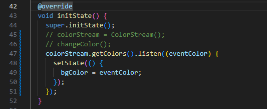
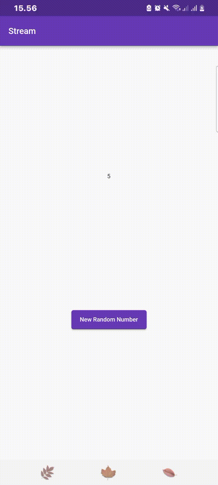
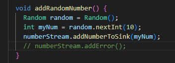
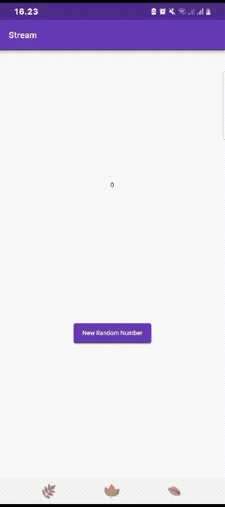

# PRAKTIKUM STATE MANAGEMENT DENGAN STREAM

NAMA: Maidy Putri Joshi

NIM: 2141720060

KELAS: TI-3F

# PRAKTIKUM 1
### Soal 1
- Tambahkan nama panggilan Anda pada title app sebagai identitas hasil pekerjaan Anda.
- Gantilah warna tema aplikasi sesuai kesukaan Anda.
- Lakukan commit hasil jawaban Soal 1 dengan pesan "W13: Jawaban Soal 1"

### Soal 2
- Tambahkan 5 warna lainnya sesuai keinginan Anda pada variabel colors tersebut.
- Lakukan commit hasil jawaban Soal 2 dengan pesan "W13: Jawaban Soal 2"

### Soal 3
- Jelaskan fungsi keyword yield* pada kode tersebut!
     Jawab: Keyword yield* pada kode tersebut digunakan untuk mendeklarasikan kepada stream atau iterable lain. Dalam konteks kode tersebut, yield* digunakan untuk menggabungkan atau menghubungkan stream yang dihasilkan oleh Stream.periodic dengan stream yang sedang didefinisikan.

- Apa maksud isi perintah kode tersebut?
     Jawab: Kode tersebut menggunakan fitur pemrograman asinkron Dart, khususnya fungsi Stream.periodic dengan kata kunci yield*. Kode ini mendefinisikan sebuah stream periodik yang menghasilkan nilai berdasarkan interval waktu yang ditentukan. Jadi, secara keseluruhan, kode ini membuat sebuah stream yang mengeluarkan warna dari daftar (colors) secara periodik, mengganti warna setiap detik. Warna-warna dipilih berdasarkan waktu yang telah berlalu sejak stream dimulai, dan stream ini berlanjut tanpa batas. Pernyataan yield* sangat penting untuk menggabungkan sifat periodik dari stream dengan logika pemilihan warna.
- Lakukan commit hasil jawaban Soal 3 dengan pesan "W13: Jawaban Soal 3

### Soal 4
- Capture hasil praktikum Anda berupa GIF dan lampirkan di README.

- Lakukan commit hasil jawaban Soal 4 dengan pesan "W13: Jawaban Soal 4"

### Soal 5
- Jelaskan perbedaan menggunakan listen dan await for (langkah 9) !
     jawab: Perbedaan utama antara listen dan await for terletak pada cara mereka menangani peristiwa dari objek Stream. Keduanya digunakan untuk mendengarkan perubahan nilai yang dikirim oleh Stream, tetapi memiliki beberapa perbedaan signifikan.
     
     Kedua pendekatan tersebut berfungsi untuk mendengarkan perubahan pada stream, dan pilihan antara keduanya tergantung pada konteks penggunaan. Jika perlu untuk mengatur ketergantungan antara peristiwa dan ingin menggunakan struktur perulangan, await for bisa menjadi pilihan yang baik. Jika hanya perlu menerima peristiwa secara asinkron tanpa memblokir eksekusi kode lainnya, listen dapat digunakan.

- Lakukan commit hasil jawaban Soal 5 dengan pesan "W13: Jawaban Soal 5"

# PRAKTIKUM 2
### Soal 6
- Jelaskan maksud kode langkah 8 dan 10 tersebut!
     jawab: 
     - langkah 8: kode tersebut berfungsi untuk menghubungkan objek NumberStream dengan widget. Saat ada perubahan pada stream (misalnya, ketika angka baru ditambahkan), widget akan memperbarui tampilannya menggunakan setState. Hal ini memastikan bahwa antarmuka pengguna dirender ulang sesuai dengan perubahan yang terjadi dalam stream.
     - langkah 10: Fungsi addRandomNumber bertujuan untuk menambahkan angka acak ke dalam suatu stream melalui objek NumberStream, dengan kata lain, fungsi addRandomNumber digunakan untuk menghasilkan angka acak dan mengirimkannya ke dalam stream, memulai aliran perubahan yang akan memengaruhi widget yang terkait dengan stream tersebut.
- Capture hasil praktikum Anda berupa GIF dan lampirkan di README.

- Lalu lakukan commit dengan pesan "W13: Jawaban Soal 6".

### Soal 7
- Jelaskan maksud kode langkah 13 sampai 15 tersebut!
     jawab:
     - langkah 13: Kode addError pada dasarnya adalah suatu fungsi yang digunakan untuk menambahkan pesan kesalahan ke dalam sink dari suatu controller dalam konteks Flutter. Dalam Flutter, sink adalah bagian dari stream controller yang bertanggung jawab untuk mengirim data ke dalam stream. Dalam hal ini, controller merujuk pada suatu instance dari stream controller, dan sink merupakan properti dari stream controller yang digunakan untuk mengirim data ke dalam stream.
     - langkah 14: Bagian kode ini menangani kesalahan yang mungkin terjadi dalam aliran data suatu stream. Ketika suatu kesalahan terdeteksi, blok pemrograman dalam metode .onError akan dijalankan. Di dalamnya, kita menggunakan setState untuk memperbarui nilai lastNumber dalam suatu widget. Dalam contoh ini, jika terjadi kesalahan dalam stream, nilai lastNumber diatur menjadi -1. Dengan pendekatan ini, widget yang terkait dengan stream dapat merespons secara dinamis terhadap kesalahan, memungkinkan tindakan yang sesuai diambil, seperti menampilkan pesan kesalahan atau memberikan umpan balik visual kepada pengguna.
     - langkah 15: Panggilan numberStream.addError() dalam fungsi ini mengindikasikan bahwa fokusnya saat ini lebih kepada menunjukkan bahwa terjadi kesalahan dalam stream. Fungsi ini secara eksplisit menambahkan pesan kesalahan ('error') ke dalam sink dari suatu stream controller (numberStream). Dengan cara ini, fungsi addRandomNumber memberikan cara untuk memicu dan menangani kesalahan di dalam aliran data.

- Kembalikan kode seperti semula pada Langkah 15, comment addError() agar Anda dapat melanjutkan ke praktikum 3 berikutnya.

- Lalu lakukan commit dengan pesan "W13: Jawaban Soal 7".

# PRAKTIKUM 3
### Soal 8
- Jelaskan maksud kode langkah 1-3 tersebut!
     jawab:
     - langkah 1: Penggunaan late memberi kita fleksibilitas untuk menentukan tipe dan menginisialisasi variabel di kemudian hari, selama sebelum kita mencoba mengakses atau menggunakan variabel tersebut. Jadi, deklarasi late StreamTransformer transformer; digunakan untuk membuat suatu variabel dengan tipe StreamTransformer, yang bersifat "late".
     - langkah 2: Metode initState yang diberikan merupakan bagian dari sebuah objek State dalam aplikasi Flutter. Kode di dalamnya menunjukkan inisialisasi variabel transformer sebagai StreamTransformer dengan tipe int ke int. Inisialisasi ini menggunakan metode statis fromHandlers pada StreamTransformer. Hal ini memiliki kemampuan untuk menentukan cara bagaimana data dalam stream diubah, bagaimana kesalahan ditangani, dan apa yang harus dilakukan ketika stream selesai.
     - langkah 3: Kode tersebut menggunakan StreamTransformer untuk memanipulasi data yang mengalir melalui suatu stream dalam aplikasi Flutter. Data dalam stream diubah menggunakan transformasi yang telah ditentukan, dan hasilnya diterapkan pada lastNumber dalam state widget. Selain itu, jika terjadi kesalahan dalam stream, nilai lastNumber diatur ke -1. Dengan pendekatan ini, widget secara dinamis merespons perubahan data dan kesalahan dalam stream untuk memperbarui tampilan sesuai.
- Capture hasil praktikum Anda berupa GIF dan lampirkan di README.

- Lalu lakukan commit dengan pesan "W13: Jawaban Soal 8".

# PRAKTIKUM 4
### Soal 9
- Jelaskan maksud kode langkah 2, 6 dan 8 tersebut!
- Capture hasil praktikum Anda berupa GIF dan lampirkan di README.
- Lalu lakukan commit dengan pesan "W13: Jawaban Soal 9".

# PRAKTIKUM 5
### Soal 10
- Jelaskan mengapa error itu bisa terjadi ?

### Soal 11
- Jelaskan mengapa hal itu bisa terjadi ?
- Capture hasil praktikum Anda berupa GIF dan lampirkan di README.
- Lalu lakukan commit dengan pesan "W13: Jawaban Soal 10,11".

# PRAKTIKUM 6
### Soal 12
- Jelaskan maksud kode pada langkah 3 dan 7 !
- Capture hasil praktikum Anda berupa GIF dan lampirkan di README.
- Lalu lakukan commit dengan pesan "W13: Jawaban Soal 12".

# PRAKTIKUM 7
### Soal 13
- Jelaskan maksud praktikum ini ! Dimanakah letak konsep pola BLoC-nya ?
- Capture hasil praktikum Anda berupa GIF dan lampirkan di README.
- Lalu lakukan commit dengan pesan "W13: Jawaban Soal 13".