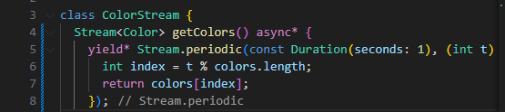

# PRAKTIKUM STATE MANAGEMENT DENGAN STREAM

NAMA: Maidy Putri Joshi

NIM: 2141720060

KELAS: TI-3F

# PRAKTIKUM 1
### Soal 1
- Tambahkan nama panggilan Anda pada title app sebagai identitas hasil pekerjaan Anda.
- Gantilah warna tema aplikasi sesuai kesukaan Anda.
- Lakukan commit hasil jawaban Soal 1 dengan pesan "W13: Jawaban Soal 1"

### Soal 2
- Tambahkan 5 warna lainnya sesuai keinginan Anda pada variabel colors tersebut.
- Lakukan commit hasil jawaban Soal 2 dengan pesan "W13: Jawaban Soal 2"

### Soal 3
- Jelaskan fungsi keyword yield* pada kode tersebut!
     Jawab: Keyword yield* pada kode tersebut digunakan untuk mendeklarasikan kepada stream atau iterable lain. Dalam konteks kode tersebut, yield* digunakan untuk menggabungkan atau menghubungkan stream yang dihasilkan oleh Stream.periodic dengan stream yang sedang didefinisikan.

- Apa maksud isi perintah kode tersebut?
     Jawab: Kode tersebut menggunakan fitur pemrograman asinkron Dart, khususnya fungsi Stream.periodic dengan kata kunci yield*. Kode ini mendefinisikan sebuah stream periodik yang menghasilkan nilai berdasarkan interval waktu yang ditentukan. Jadi, secara keseluruhan, kode ini membuat sebuah stream yang mengeluarkan warna dari daftar (colors) secara periodik, mengganti warna setiap detik. Warna-warna dipilih berdasarkan waktu yang telah berlalu sejak stream dimulai, dan stream ini berlanjut tanpa batas. Pernyataan yield* sangat penting untuk menggabungkan sifat periodik dari stream dengan logika pemilihan warna.
- Lakukan commit hasil jawaban Soal 3 dengan pesan "W13: Jawaban Soal 3

### Soal 4
- Capture hasil praktikum Anda berupa GIF dan lampirkan di README.

- Lakukan commit hasil jawaban Soal 4 dengan pesan "W13: Jawaban Soal 4"

### Soal 5
- Jelaskan perbedaan menggunakan listen dan await for (langkah 9) !
- Lakukan commit hasil jawaban Soal 5 dengan pesan "W13: Jawaban Soal 5"

# PRAKTIKUM 2
### Soal 6
- Jelaskan maksud kode langkah 8 dan 10 tersebut!
- Capture hasil praktikum Anda berupa GIF dan lampirkan di README.
- Lalu lakukan commit dengan pesan "W13: Jawaban Soal 6".

### Soal 7
- Jelaskan maksud kode langkah 13 sampai 15 tersebut!
- Kembalikan kode seperti semula pada Langkah 15, comment addError() agar Anda dapat melanjutkan ke praktikum 3 berikutnya.
- Lalu lakukan commit dengan pesan "W13: Jawaban Soal 7".

# PRAKTIKUM 3
### Soal 8
- Jelaskan maksud kode langkah 1-3 tersebut!
- Capture hasil praktikum Anda berupa GIF dan lampirkan di README.
- Lalu lakukan commit dengan pesan "W13: Jawaban Soal 8".

# PRAKTIKUM 4
### Soal 9
- Jelaskan maksud kode langkah 2, 6 dan 8 tersebut!
- Capture hasil praktikum Anda berupa GIF dan lampirkan di README.
- Lalu lakukan commit dengan pesan "W13: Jawaban Soal 9".

# PRAKTIKUM 5
### Soal 10
- Jelaskan mengapa error itu bisa terjadi ?

### Soal 11
- Jelaskan mengapa hal itu bisa terjadi ?
- Capture hasil praktikum Anda berupa GIF dan lampirkan di README.
- Lalu lakukan commit dengan pesan "W13: Jawaban Soal 10,11".

# PRAKTIKUM 6
### Soal 12
- Jelaskan maksud kode pada langkah 3 dan 7 !
- Capture hasil praktikum Anda berupa GIF dan lampirkan di README.
- Lalu lakukan commit dengan pesan "W13: Jawaban Soal 12".

# PRAKTIKUM 7
### Soal 13
- Jelaskan maksud praktikum ini ! Dimanakah letak konsep pola BLoC-nya ?
- Capture hasil praktikum Anda berupa GIF dan lampirkan di README.
- Lalu lakukan commit dengan pesan "W13: Jawaban Soal 13".